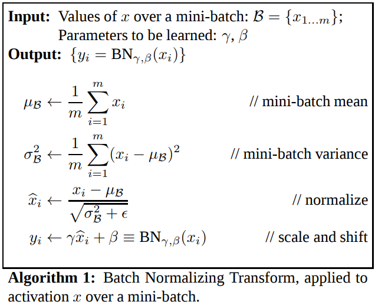
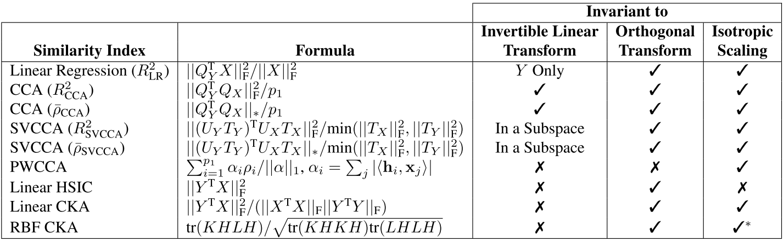

Kornblith et al recently asked, what ought a similarity metric for comparing neural networks be invariant to? They reviewed and related several methods including linear regression, canonical correlation analysis (and its variants) and Centered Kernel Alignment.

What about representational similarity analysis (RSA), which is not common for comparing neural networks but is very common for comparing representational models to recordings of neural responses. RSA takes as input paired observations $X_1, X_2$ in two different representational spaces, e.g. monkey visual cortex responses to a set of images and human visual cortex responses to those same images. RSA depends on the metric $\delta$ used to calculate pairwise distances between observations and metric $\phi$ used to calculate the similarity between the resulting dissimilarity matrices. If RSA is invariant to some transformation $T$, then the application $T$ to either input should have no affect on the resulting similarity value:

$$RSA(X_1, X_2 | \delta, \phi) = RSA(T(X_1), X_2 | \phi) = RSA(X_1, T(X_2) | \phi)$$

If the pairwise distances between observations, calculated according to $\delta$, are unchanged by $T$, then RSA will be invariant to $T$. RSA will also be invariant to transformations that *do not* preserve pairwise distances if $\phi$ is not sensitive to the changes in the dissimilarity matrix.

# Background
## Linear Transformation
A linear transformation $T$ between two vector spaces $V$ and $W$ is a map $T : V \rightarrow W$ such that:
1. $T(\mathbf{v}_1 + \mathbf{v}_2) = T(\mathbf{v}_1) + T(\mathbf{v}_2)$
2. $T(\alpha \mathbf{v}) =  \alpha T(\mathbf{v})$ for any $\alpha$

## Linear Invertible Transformations
If $V$ and $W$ have the same dimension, then it is possible for $T$ to be invertible, meaning that there exists some inverse transformation $T^{-1}$ that "undoes" the effect of $T$ such that $TT^{-1} = 1$.

## Isotropic Scaling
Uniform (or isotropic) scaling is a linear transformation that englarges or shrinks objects by a scale factor that is the same in all directions.

## Affine transformations

## Isometries
Isometries are distance preserving transformations.

## Orthonormal/Orthogonal Transformations
Orthogonal transformations are linear invertible transformations that preserve the lengths of vectors and angles between vectors.
$$\langle v, w\rangle = \langle Tv, Tw \rangle$$
An orthogonal transformation is a rotation, a reflexion or a rotation followed by a reflexion and can be represented with an orthogonal matrix. An orthogonal matrix is necessarily invertible and so all orthogonal matrices are invertible.

### Permutation
A transformation that permutes the dimensions of a given vector space rotates the space in intervals of 90 degrees.

# Batch Norm

When Batch normalization is applied between two layers, the output of one layer is standardized with respect to the current mini-batch before being passed on as input to the subsequent layer. Standardization consists of centering at zero (removing the mean) and dividing by the standard deviation to achieve unit variance.

Centering is a translation while the normalization step consists of uniform (isotropic scaling) so batch normalization is a linear invertible transformation but not an orthogonal transformation.

# What transformations are similarity metrics invariant to?

## Representational Similarity Analysis
What kinds of transformations is RSA invariant to? What types of $T$ satisfy $RSA(x, y) = RSA(T(x), y)$?

orthogonal transformations? yes
isomorphic scaling? no?
translations? yes
shear? no
all linear invertible transformations? no

# References
1. http://mathworld.wolfram.com/LinearTransformation.html
2. http://linear.ups.edu/html/section-IVLT.html
3. http://mathworld.wolfram.com/OrthogonalTransformation.html
4. https://en.wikipedia.org/wiki/Scaling_(geometry)
